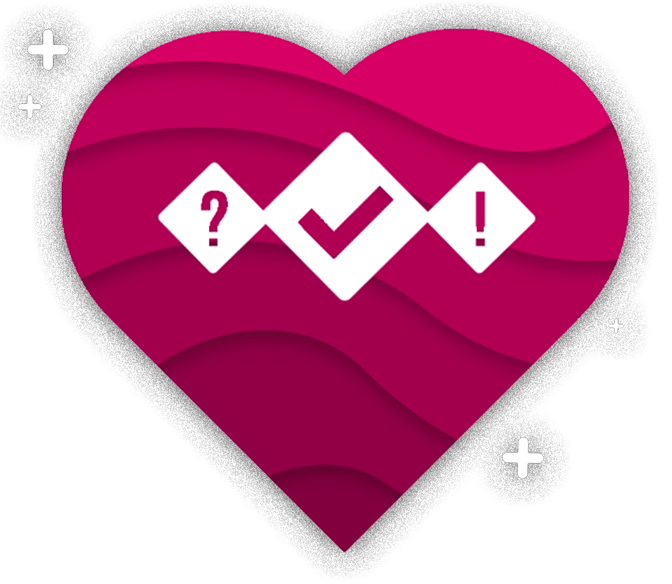

<!-- PROJECT LOGO -->
<br />
<p align="center">
  <a href="#">
    
  </a>

  <h3 align="center">Passionly-API</h3>

  <p align="center">
    API made for Passionly project!
    <br />
    <!--
    <a href="#"><strong>Explore the docs »</strong></a>
    <br />
    <br />
    <a href="#">View Demo</a>
    ·
    <a href="#">Report Bug</a>
    ·
    <a href="#">Request Feature</a>
    -->
  </p>
</p>


<!-- TABLE OF CONTENTS -->
## Table of Contents

* [About the Project](#about-the-project)
  * [Built With](#built-with)
* [Getting Started](#getting-started)
  * [Prerequisites](#prerequisites)
  * [Installation](#installation)
* [Usage](#usage)
* [License](#license)
* [Contact](#contact)


<!-- ABOUT THE PROJECT -->
## About The Project

[![Passionly][product-screenshot]](#)


### Built With
* [NodeJS](https://nodejs.org/)
* [ExpressJS](http://expressjs.com/)
* [JWT](https://jwt.io/)


<!-- GETTING STARTED -->
## Getting Started

### Prerequisites

To run this project, you will need:
* npm
```sh
npm install npm@latest -g
```
* [postgres](https://www.postgresql.org/download/)

### Installation

1. Clone the repo
```sh
git clone https://gitlab.univ-artois.fr/dylan_donne/passionly-api
```
2. Install NPM packages
```sh
npm install
```
3. Create a `config.js` in `/config` folder
```JS
const db_config = {
  user: 'passionly',
  host: 'localhost',
  database: 'api',
  password: 'password',
  port: 5432
}

const app_config = {
  http_port: 3000,
  https_port: 8443
}

const auth_config = {
  secret: "itsasecret"
}

module.exports = {
  db_config,
  app_config,
  auth_config
}
```
4. Create a Firebase APP and download the `serviceAccountKey.json` to the root folder
5. Build api bundle
```sh
npm run build
```
6. API is ready to be published ! Enjoy


<!-- USAGE EXAMPLES -->
## Usage

This API has been specially designed for Passionly Client.

<!--
_For more examples, please refer to the [Documentation](#)_
-->


<!-- LICENSE -->
## License

Distributed under the MIT License. See `LICENSE` for more information.


<!-- CONTACT -->
## Contact

DONNE Dylan - [@Killax_Dev](https://twitter.com/Killax_Dev) - contact@dylan-donne.fr


<!-- MARKDOWN LINKS & IMAGES -->
<!-- https://www.markdownguide.org/basic-syntax/#reference-style-links -->
[linkedin-url]: www.linkedin.com/in/dylan-donne
[product-screenshot]: assets/rest.png
